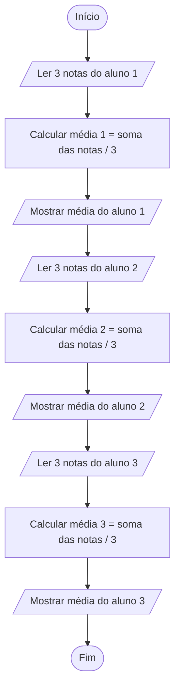

# Aula 2 — Lógica de Programação

> **Curso:** Programação para Iniciantes — FMP  
> **Unidade:** Lógica de programação  
> **Objetivo:** aprender a analisar um problema, organizar uma solução em etapas e representá-la visualmente antes de escrever código.

---

## 1. Da necessidade ao problema

Programar começa antes de abrir uma IDE: começa por entender **qual problema precisa ser resolvido**.

Uma descrição vaga como “calcular as médias da turma” precisa ser esclarecida:
- Quantos alunos serão avaliados?
- Quantas notas cada aluno possui?
- Como a média será calculada?
- O que deve ser apresentado ao final?

**Problema desta aula:** uma turma tem 3 alunos. Cada aluno possui 3 notas. Precisamos calcular e mostrar a média de cada um.

## 2. Pensar logicamente para resolver

Raciocinar logicamente é organizar ações de maneira coerente, verificando o que precisa acontecer primeiro, quais informações são necessárias e como obter o resultado.

Uma estratégia simples:
1. **Entender:** identificar o que foi pedido.
2. **Identificar dados:** descobrir quais informações serão necessárias.
3. **Definir o resultado:** determinar o que deve ser produzido.
4. **Planejar:** organizar as ações em uma ordem coerente.
5. **Conferir:** verificar se o plano resolve o problema.

### Decomposição: dividir para conquistar

Um problema grande pode ser dividido em tarefas menores:
- obter as três notas do aluno;
- somar as notas;
- dividir a soma por 3;
- apresentar a média;
- repetir o procedimento para os demais alunos.

Cada etapa é simples; juntas, resolvem o problema completo.

## 3. Algoritmo: uma prévia

Um **algoritmo** é uma sequência finita de passos, organizados logicamente, com a finalidade de chegar a uma solução.

Nesta aula, veremos apenas a ideia. Na próxima, estudaremos algoritmos com mais profundidade.

```text
1. Receber três notas
2. Somar as notas
3. Dividir a soma por três
4. Mostrar a média
```

Um algoritmo precisa ter passos compreensíveis, ordem coerente e um ponto de término.

## 4. Por que não usar Portugol e VisualG?

Em muitos cursos introdutórios, a lógica é ensinada com **Portugol**, uma representação didática de algoritmos com palavras e estruturas semelhantes às de uma linguagem de programação. Uma ferramenta bastante utilizada é o **VisualG**.

Neste curso, vamos trabalhar diretamente com **Python**. Como a carga horária é curta, aprender uma linguagem didática e depois migrar para outra exigiria tempo adicional de adaptação. Python permite estudar os fundamentos e praticar com uma linguagem usada em contextos reais, como automação, análise de dados e desenvolvimento.

Isso não significa que Portugol ou VisualG sejam inúteis. São recursos didáticos válidos; apenas não serão a ferramenta escolhida neste curso.

> **A lógica não pertence a uma linguagem específica.** O mesmo raciocínio pode ser representado em fluxograma, Portugol, Python, C ou outras linguagens.

## 5. O computador continua sendo literal

Como vimos na aula anterior, o computador não interpreta nossa intenção: executa instruções conforme foram definidas.

Dizer “calcule a média” é suficiente para uma pessoa familiarizada com a tarefa, mas um programa precisa de instruções explícitas:
- quais valores utilizar;
- qual operação realizar;
- quantas vezes executar o procedimento;
- como apresentar o resultado.

A lógica de programação estrutura essas instruções de forma clara e coerente.

## 6. Fluxogramas

Um **fluxograma** representa visualmente as etapas de um processo por meio de símbolos conectados por setas. Ajuda a visualizar a ordem das ações e os caminhos possíveis antes de escrever código.

### Símbolos principais

| Símbolo | Significado | Uso |
|---|---|---|
| Oval / terminador | Início ou fim | Marca os limites do processo |
| Paralelogramo | Entrada ou saída | Ler dados ou apresentar resultados |
| Retângulo | Processamento | Calcular ou atribuir valores |
| Losango | Decisão | Avaliar uma condição e escolher um caminho |
| Seta | Fluxo | Indica a sequência das etapas |

### Fluxo básico

```text
   ( INÍCIO )
        |
        v
  / ENTRADA /
        |
        v
 [PROCESSAMENTO]
        |
        v
   / SAÍDA /
        |
        v
     ( FIM )
```

Nem todo algoritmo precisa de uma decisão. O losango é usado quando o caminho depende de uma condição, como “a média é maior ou igual a 7?”.

## 7. Exemplo: média de três notas para três alunos

### Regras
- São avaliados 3 alunos.
- Cada aluno possui 3 notas.
- Média = soma das notas dividida por 3.
- O programa apresenta a média de cada aluno.

O fluxograma mostra o procedimento completo para os três alunos, sem introduzir ainda estruturas de repetição formais.



### Exemplo numérico

| Aluno | Nota 1 | Nota 2 | Nota 3 | Média |
|---|---:|---:|---:|---:|
| 1 | 7 | 8 | 9 | 8,0 |
| 2 | 6 | 7 | 8 | 7,0 |
| 3 | 5 | 6 | 7 | 6,0 |

O exemplo repete três vezes o mesmo procedimento. Mais adiante, veremos como estruturas de repetição evitam essa repetição no código.

## 8. Fechamento

- Resolver um problema começa por compreendê-lo.
- Dados de entrada e resultados esperados precisam ser identificados.
- Dividir um problema em tarefas menores facilita sua solução.
- Um algoritmo organiza passos finitos em sequência lógica.
- Fluxogramas representam visualmente processos.
- A lógica pode ser aplicada em diferentes linguagens.
- Python será a linguagem prática adotada no curso, sem etapa separada em Portugol.

### Preparação para a Aula 3

Na próxima aula, aprofundaremos **algoritmos**: como descrever soluções passo a passo e transformar o raciocínio em uma representação que possa ser implementada em Python.
